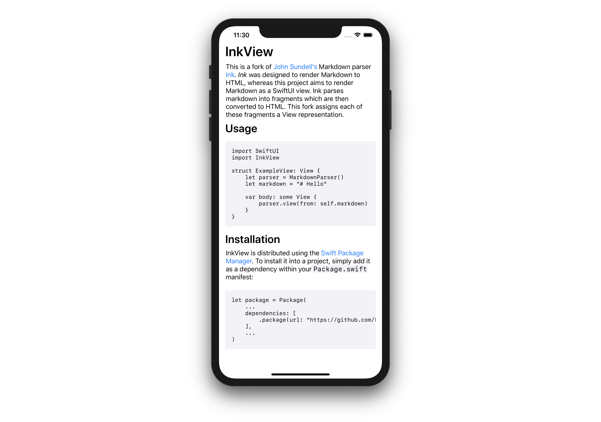

:warning: Under Construction :warning:

# InkView
This is a fork of [John Sundell's](https://twitter.com/johnsundell) Markdown parser [Ink](https://github.com/JohnSundell/Ink).  Ink was designed to render Markdown to HTML, whereas this project aims to render Markdown as a SwiftUI view.  Ink parses markdown into fragments which are then converted to HTML.  This fork assigns each of these fragments a View representation.

## Usage
```swift
import SwiftUI
import InkView

struct ExampleView: View {
    let parser = MarkdownParser()
    let markdown =
    """
    # Hello
    ---
    This is a **markdown** document.
    > Pretty cool
    """
    
    var body: some View {
        parser.view(from: self.markdown)
    }
}
```



## Installation

InkView is distributed using the [Swift Package Manager](https://swift.org/package-manager). To install it into a project, simply add it as a dependency within your `Package.swift` manifest:

```swift
let package = Package(
    ...
    dependencies: [
        .package(url: "https://github.com/Finnvoor/InkView.git", .branch("master"))
    ],
    ...
)
```

Then import InkView wherever you’d like to use it:

```swift
import InkView
```

For more information on how to use the Swift Package Manager, check out [this article](https://www.swiftbysundell.com/articles/managing-dependencies-using-the-swift-package-manager), or [its official documentation](https://github.com/apple/swift-package-manager/tree/master/Documentation).

## Supported syntax
InkView currently supports the following Markdown features:

- Headings (H1 - H6), using leading pound signs, for example `## H2`.
- Italic text, by surrounding a piece of text with either an asterisk (*), or an underscore (_). For example *Italic text*.
- Bold text, by surrounding a piece of text with either two asterisks (**), or two underscores (__). For example **Bold text**.
- Text strikethrough, by surrounding a piece of text with two tildes (~~), for example ~~Strikethrough text~~.
- Inline code, marked with a backtick on either site of the code.
- Code blocks, marked with three or more backticks both above and below the block.
- Links, using the following syntax: `[Title](url)`.
- Horizontal lines can be placed using either three asterisks (`***`) or three dashes (`---`) on a new line.
- Blockquotes can be created by placing a greater-than arrow at the start of a line, like this: `> This is a blockquote`.

